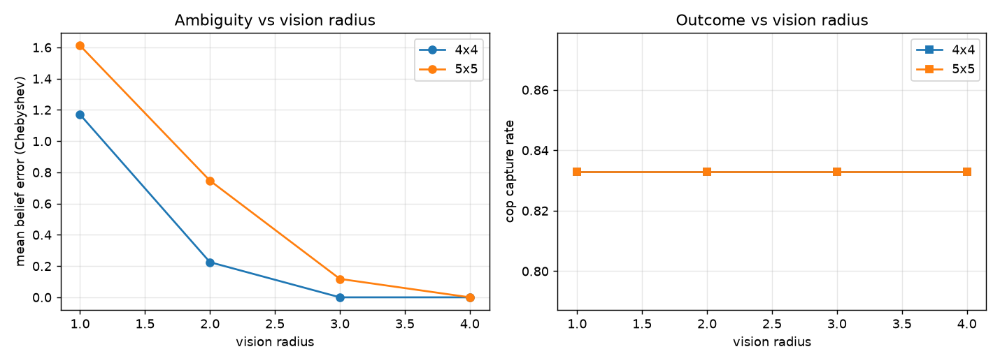
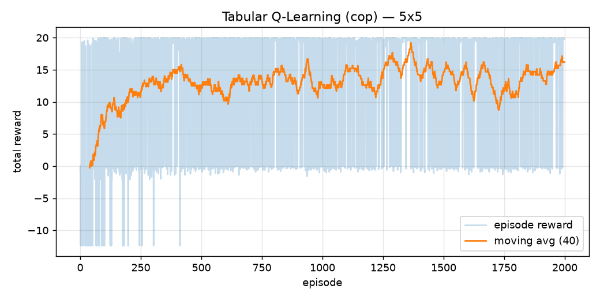

# Dual AI Agent Pursuit via MCP Servers — Cop & Thief under Partial Observability

> **moamteam** · Assignment 6, "Orchestration of AI Agents" (Dr. Yoram Segal, University of Haifa)
> Two autonomous LLM agents chase each other on a dynamic grid, coordinating exclusively
> through **free natural-language messages routed over two independent MCP servers** —
> from handshake to an automatically emailed JSON report, with zero human intervention.

Project docs: [`docs/`](docs/) · Plan & task board: [`plan/`](plan/) · Evidence: [`artifacts/`](artifacts/)

---

## 1. Abstract

We built an end-to-end orchestration pipeline in which two independent LLM agents — a Cop
and a Thief — play a pursuit game on a configurable 2D grid while exchanging **only free
natural-language prose** (no protocol, no coordinates) over two token-protected FastMCP
servers. The orchestrator (MCP client) owns the LLM (DeepSeek `deepseek-chat` via its
OpenAI-compatible API), interprets each message into a belief distribution over the
opponent's position, and applies a legality-guarded action to a deterministic game
engine. The full autonomous series — 6 valid sub-games with technical-loss voiding,
per-turn integrity verification, live GUI evidence, and a JSON-only Gmail report — runs
unattended. A real DeepSeek series over live MCP servers on 5×5 produced a genuinely
contested outcome (cop 4 : thief 2, 166 turns, 0 technical losses, 98.8% of LLM replies
directly legal), and controlled experiments quantify how vision radius drives belief
error, plus a tabular Q-learning baseline that more than doubles its mean episode reward.

## 2. Formal model — Dec-POMDP

The pursuit game is a **Decentralized Partially Observable Markov Decision Process**:

$$\langle n,\; S,\; \{A_i\},\; P,\; R,\; \{\Omega_i\},\; O,\; \gamma \rangle$$

| Element | Instantiation here |
|---|---|
| $n$ | 2 agents (Cop, Thief) |
| $S$ | $\text{pos}_c \times \text{pos}_t \times 2^{\text{cells}}\ (\text{barriers}) \times \{0..25\}\ (\text{rounds}) \times \text{turn}$ |
| $A_{cop}$ | 8 compass moves ∪ {place_barrier} (≤5, on current cell) |
| $A_{thief}$ | 8 compass moves |
| $P$ | deterministic transitions; illegal actions rejected by the engine (typed errors) |
| $R$ | capture: (+20, +5); escape at round 25: (+5, +10) — all values from `config.json` |
| $\Omega_i$ | own position, cells within vision radius $r$, observed barriers, opponent's **free-text message** |
| $O$ | deterministic local vision ⊕ a stochastic *linguistic channel* (messages may be truthful, vague, or deceptive) |
| $\gamma$ | 0.9 (Q-learning experiments) |

For a $W{\times}H$ board the positional state space is $W^2H^2$ per barrier configuration
(625 position pairs on 5×5, times $\sum_{k\le5}\binom{25}{k}$ barrier sets). What makes
this instance scientifically interesting is not $|S|$ but $O$: half of each agent's
observation arrives through **natural language produced by an adversary**, so the
observation function itself is strategic — an agent must model not just *where* the
opponent is, but *why it said what it said*.

## 3. System architecture

Full diagrams: [`docs/ARCHITECTURE.md`](docs/ARCHITECTURE.md). The three architectural
laws from the assignment, and where each is enforced:

1. **Two independent MCP servers** — `src/servers/` builds role-parameterized FastMCP
   instances (cop `:8001`, thief `:8002`; same image deploys to two cloud URLs via
   `render.yaml` + `deploy/Dockerfile`). Servers expose six tools (`handshake`,
   `send_message`, `receive_message`, `report_position`, `verify_state`,
   `get_game_config`), hold message queues and audit logs — **no rules, no LLM**.
2. **The LLM lives in the client** — `src/orchestrator.py` is the MCP client: it queries
   DeepSeek, receives the decision, calls the MCP tools, and advances the engine
   (`src/engine/`, pure and deterministic).
3. **Zero hard-coding** — every parameter (grid, moves, barriers, scoring, radii, model,
   ports, recipient) lives in `config.json`; a "weird-config" test proves behavior tracks
   the file (7×3 grid, 9-move cap, custom scores).

Security: bearer token at handshake (rotation = revoke), session-capability for
subsequent calls, gitignored `.env` for all secrets, outbound-only client posture
(hybrid Approach 3), and `scripts/cloud_verify.py` produces the auth-rejection evidence.

## 4. Orchestration challenges & how we addressed them

**(a) Protocol-less communication.** The personas (prompt files,
`src/agents/personas/`) forbid coordinate conventions and demand 1–2 sentences of prose;
an automated test rejects any run whose messages contain coordinate tokens. What emerges
is negotiation-like behavior — from the live 5×5 run:

> **thief**: "Corner? I'm already behind you, you're the one trapped now!"
> **cop**: "Bold talk for someone who's standing right in front of me. There's nowhere to hide."

**(b) Linguistic ambiguity & deception.** Each agent maintains a belief grid
(`src/agents/belief.py`) updated from three sources of decreasing trust: hard vision
(collapse/exclusion), motion constraints (≤1 cell/turn spread), and the LLM's reading of
the opponent's message — blended at only 25% weight *because the channel is adversarial*.
In the live 5×5 run the mean belief error was **0.89 cells** and the agents pinpointed
each other exactly on **35% of turns** despite a vision radius of 2 on a 5×5 board.

**(c) Ensuring mutual understanding & liveness.** Three safety layers guarantee an
autonomous run never stalls: a defensive parser with one repair round-trip; a legality
guard that swaps illegal LLM proposals for a distance-heuristic move (only 2 of 166
turns needed it); and `verify_state` turn-counter checks on every turn (166/166 OK).
A turn exceeding `turn_timeout_s` raises a technical loss — the sub-game is **voided and
re-run**, keeping the reported series at exactly 6 valid games. This path was proven in
production when a DeepSeek latency spike (35 s/call) blew the original 60 s budget: the
pipeline voided the game, we retuned the budget, and the series completed cleanly.

## 5. Experiments & results

**Live autonomous series (real DeepSeek, real MCP servers over HTTP).**

| Run | Result | Integrity |
|---|---|---|
| 5×5, radius 2 | cop 4 : thief 2 (two move-limit escapes, one barrier) → totals 90:40 | 166 turns, 0 technical losses, 2 guarded fallbacks, 166/166 verify_state OK |
| 2×2 (ladder stage 1) | cop 6 : thief 0, all captures ≤2 rounds | 18 turns, 0 losses, 0 fallbacks — trivially cop-favored, as expected |

**Ambiguity vs vision radius** (`scripts/vision_sweep.py`, 12 games/cell, deterministic
agents so perception is isolated from policy):
mean belief error falls monotonically with radius — 5×5: **1.61 → 0.75 → 0.12 → 0.00**
cells for r=1..4; 4×4: 1.17 → 0.23 → 0 → 0. Below r=2 on 5×5 the opponent is effectively
invisible most of the game and inference rests on the linguistic channel alone.


**Tabular Q-learning** (`src/agents/qlearn.py`; Bellman update, ε-greedy 1.0→0.05,
α=0.1, γ=0.9, 2000 self-play episodes vs a random evader, state = position pair):
mean episode reward improved **6.81 → 14.81** (first vs last decile).


## 6. Proofs of autonomous operation

- **GUI evidence**: per-sub-game boards with barriers + message feed —
  `artifacts/screenshots/run_20260702_132018_sub*.png` (live 5×5 series).
- **Full NL transcripts**: `artifacts/transcripts/deepseek_5x5_transcript.md` (166
  turns) and `deepseek_2x2_transcript.md`.
- **CLI/JSONL logs** (per-turn actor, action, belief error, verify_ok, message; per-call
  LLM latency/tokens): `artifacts/logs/run_20260702_132018*.jsonl`.
- **Security battery output**: `artifacts/security/cloud_verify_*.txt` (wrong-token
  rejection, 50-message ordering, state verification — rerun against cloud URLs on deploy).
- **Report email**: JSON-only body per spec §9 (see `docs/REPORTING_SPEC.md`); sender
  runs in draft mode until the final graded run.
- Cloud URLs + cloud run logs: *pending platform account* — see `docs/RUNBOOK_cloud.md`
  (everything scripted; one browser signup remains).

## 7. Reproduce

```powershell
uv sync
# terminals 1+2 — the two MCP servers
uv run python -m src.servers.cop_server
uv run python -m src.servers.thief_server
# terminal 3 — full autonomous series (report built, email skipped)
uv run python -m src.orchestrator --no-email
# fast/free variants and experiments
uv run python -m src.orchestrator --grid 2x2 --in-memory --mock-llm --no-email
uv run pytest                       # 50+ tests incl. E2E ladder 2x2..5x5
uv run python scripts/vision_sweep.py
uv run python -m src.agents.qlearn --role cop
uv run python -m src.gui.replay artifacts/logs/<run>_turns.jsonl   # watch a recorded game
```

Secrets (gitignored `.env`): `DEEPSEEK_API_KEY`, `MCP_COP_TOKEN`, `MCP_THIEF_TOKEN`,
`GOOGLE_CREDENTIALS_PATH`, `GOOGLE_TOKEN_PATH` — see [`docs/ENVIRONMENT.md`](docs/ENVIRONMENT.md).

## 8. Team — moamteam

| Student | ID |
|---|---|
| Mohammad Yosef | [REDACTED] |
| Amear Abu Farekh | [REDACTED] |
