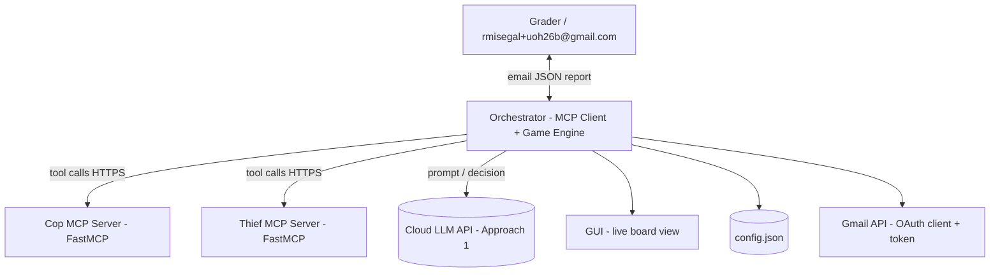
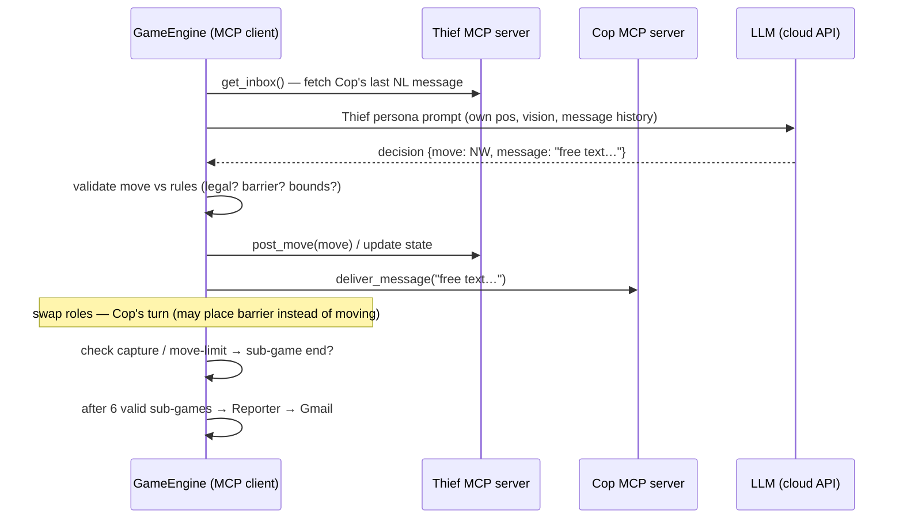

# ARCHITECTURE — MCP Dual-Server Orchestration

> Companion to `HW6_DECLARATION.md` and the PRDs. Diagrams are Mermaid.

## 1. Core architectural laws (from the spec)

1. **Two independent MCP servers** — one for the Cop, one for the Thief. Separate processes,
   separate ports (local), separate public URLs (cloud).
2. **The LLM is NOT hosted inside the MCP server.** The MCP server exposes **tools,
   resources, prompts** only (built with **FastMCP**).
3. **The MCP client = the game engine / orchestrator** (our code). It manages the dialogue
   and the logic: sends the query to the LLM, receives the tool-call decision, invokes the
   MCP server tool, returns the result to the LLM to complete the turn.
4. **Agents communicate in free natural language** — never a rigid protocol of raw coordinates.
5. **No hard-coded parameters** — everything from `config.json`.

## 2. C4-L1 Context



## 3. C4-L2 Containers

```mermaid
flowchart TD
    subgraph Local["Local machine (dev) / Cloud (final)"
        subgraph Servers
            COP[cop_server.py - FastMCP :8001]
            THF[thief_server.py - FastMCP :8002]
        end
    end
    subgraph Client["Orchestrator (always local)"]
        ENG[GameEngine - state machine, rules, scoring]
        AGC[CopAgent - LLM persona]
        AGT[ThiefAgent - LLM persona]
        MSG[NL Message layer - compose/interpret]
        REP[Reporter - JSON builder + Gmail sender]
        GUI[GUI renderer]
        LOG[Structured logger - CLI proof logs]
    end
    ENG --> AGC & AGT
    AGC & AGT --> MSG
    AGC -->|tools| COP
    AGT -->|tools| THF
    AGC & AGT --> LLMAD[LLM adapter]
    LLMAD --> API[(Anthropic/OpenAI/Gemini API)]
    ENG --> REP --> GMAILAPI[(Gmail API)]
    ENG --> GUI
    ENG --> LOG
```

## 4. Turn sequence



## 5. MCP tool surface (per server, FastMCP)

| Tool | Purpose |
|---|---|
| `handshake(token)` | auth + session open; verifies bearer token |
| `send_message(text)` | deposit free-text NL message for the opponent |
| `receive_message()` | fetch pending opponent message |
| `report_position(pos)` | agent registers its own position with its server (mutual location verification requirement) |
| `verify_state(turn_id)` | integrity check — both servers agree on turn number |
| `get_game_config()` | resource: relevant config slice |

Exact signatures live in `PRD_mcp_servers.md`; they are the **frozen contract** that lets
tracks work in parallel.

## 6. LLM connection — the three approaches (spec §7)

| # | Approach | Verdict for us |
|---|---|---|
| 1 | **Cloud API** (Anthropic/OpenAI/Gemini) called by the client with an API key. Stable, fast, no local exposure; short chats ⇒ near-zero cost. | ✅ **Primary** |
| 2 | Local **Ollama** (:11434, loopback-only, no built-in auth) exposed via secured tunnel — ngrok + traffic policy (Basic Auth via `ollama.yaml`, Authorization header), or Localtonet, or self-managed **Nginx reverse proxy** (SSL termination, htpasswd, Certbot, UFW/nftables). | ⚠️ documented, not used |
| 3 | **Hybrid**: LLM (local or API) + game client both local; only MCP servers in cloud; client makes **outbound HTTPS** only — no inbound ports, no IP exposure. | ✅ **Dev mode** |

**Security emphasis (spec):** cloud MCP URLs must be publicly reachable (no corporate
firewall); each team needs **two URLs** (cop, thief); implement **token auth with revoke**.

## 7. Deployment phases

1. **Local:** both servers on localhost, separate ports (8001/8002); full pipeline green.
2. **Cloud:** deploy both MCP servers to public cloud (e.g. Prefect Cloud or similar
   platform); token-based auth; verify with CLI logs (these logs are README evidence).
3. **Inter-group bonus:** our orchestrator ↔ their MCP servers and vice versa.

## 8. Decision layer

- Baseline: **heuristic** (Chebyshev distance minimization/maximization + barrier value
  estimate + belief grid over opponent position from message interpretation).
- Optional (recommended in spec, we implement if time allows): **Tabular Q-Learning**
  (Bellman update, epsilon-greedy), states = grid cells (or engineered features),
  4–8 actions; sample code in the spec §8.2. No deep nets.

## 9. Repo layout (target)

```
aihw6/
├── config.json               # single source of runtime truth
├── pyproject.toml            # uv project
├── src/
│   ├── engine/               # Track A: board, rules, state machine, scoring
│   ├── servers/              # Track B: cop_server.py, thief_server.py (FastMCP)
│   ├── agents/               # Track C: personas, LLM adapter, strategy, belief
│   ├── gui/                  # Track D: live visualization
│   ├── reporting/            # Track E: JSON report + Gmail sender
│   └── common/               # config loader, schemas, logging
├── tests/                    # sanity ladder 2x2 → 5x5, unit + integration
├── docs/                     # this folder
├── plan/                     # PLAN, TODO, TASK_BOARD, tasks/
└── README.md                 # scientific report (deliverable)
```
