# PLAN — Master Execution Plan (multi-agent, parallel)

> Phases follow the spec's engineering priority order (Table 4), reorganized into
> **6 parallel tracks** with explicit sync points. Tracks map 1:1 to `plan/tasks/TRACK_*.md`
> and to the sub-PRDs in `docs/`.

## 0. Sync points (contract freezes)

| Freeze | What locks | Unblocks |
|---|---|---|
| **SP-0** | `config.json` schema, `GAME_RULES.md`, `REPORTING_SPEC.md` | everything (already frozen by these docs) |
| **SP-1** | Engine interfaces (`Engine`, `SeriesManager`, `SubGameRecord`, `Observation`) | C, D, E |
| **SP-2** | MCP tool signatures (PRD_mcp_servers §2) | C, F |
| **SP-3** | Local E2E green (5×5 autonomous series) | F (cloud), README evidence capture |

## 1. Phase map (spec Table 4 → tracks)

| Phase | Spec stage | Track | Deliverable | Depends on |
|---|---|---|---|---|
| P1 | 1. game logic & rules | **A** | engine + config loader, unit tests, 2×2 ladder | — |
| P2 | 2. basic MCP infra | **B** | two FastMCP servers, tools, local auth | SP-0 |
| P3 | 3. full local run | **C** | orchestrator loop, mock-LLM then real LLM, localhost E2E | SP-1, SP-2 |
| P4 | 4. decision mechanism | **C** | heuristic baseline + belief grid (+ Q-Table module) | P3 |
| P5 | 5. natural language | **C** | personas, free-text messaging, ambiguity handling | P3 |
| P6 | 6. GUI | **D** | live board + message feed + PNG export | SP-1 (parallel from day 1) |
| P7 | 7. cloud deploy | **F** | 2 public URLs, tokens, 401 proofs, external-network test | SP-3 |
| P8 | 8. Gmail reporting | **E** | Google client/token setup, report builder, draft-mode e2e | SP-0 (parallel from day 1) |
| P9 | README + evidence | all | scientific README, screenshots, logs, rubric audit | P1–P8 |
| ~~P10~~ | ~~Bonus~~ | — | **WAIVED** — bonus window closed for students (decision 2026-07-02) | — |

## 2. Parallelism model

```mermaid
gantt
    dateFormat  X
    axisFormat %s
    section Track A (engine)
    P1 engine+config          :a1, 0, 3
    section Track B (MCP)
    P2 servers+tools          :b1, 0, 3
    section Track E (reporting)
    P8 google setup+builder   :e1, 0, 3
    section Track D (GUI)
    P6 renderer (mock events) :d1, 1, 4
    section Track C (agents)
    P3 orchestrator loop      :c1, 3, 6
    P4 strategy / P5 NL       :c2, 6, 9
    section Track F (cloud)
    P7 deploy+security        :f1, 9, 11
    section All
    P9 README+audit           :r1, 9, 12
    P10 bonus window          :x1, 11, 13
```

- **Day 0 kick-off, 4 agents in parallel:** A (engine), B (MCP), E (Google/OAuth + report
  builder against frozen schema), D (GUI against mocked `TurnResult` events).
- **C starts** when A+B publish their frozen interfaces (SP-1/SP-2) — target day 2–3.
- **F starts** only after local E2E (SP-3); before that F prepares platform account,
  deployment scripts, token scheme (paper work in parallel).
- Every track works ONLY in its owned paths (see `TASK_BOARD.md`) → no merge conflicts.

## 3. Risk register

| Risk | Impact | Mitigation |
|---|---|---|
| LLM outputs unparseable / illegal moves | game crashes ≠ autonomy | repair round-trip + heuristic fallback (PRD_agents_llm §2.2, §2.5) |
| Cloud platform blocks MCP transport | P7 slip | 3-platform fallback chain (PRD_cloud_security §2.2); ngrok+policy last resort |
| OAuth token expiry at demo time | report fails | delete-token re-auth drill; draft-mode rehearsal; guide §22 pitfalls doc'd |
| Turn deadlocks between servers | technical loss loop | `verify_state` + turn timeout + voiding logic tested (TESTING §Integration) |
| Bonus JSON mismatch with partner | 0 pts both | reconcile step + byte-diff of both payloads before either sends |
| Windows GUI on headless cloud | crash | `gui.enabled=false` default on cloud path (PRD_gui §2.4) |

## 4. Timeline anchors

- Assignment published: **19-06-2026**. Bonus window closed → **P10 waived**, all effort on P1–P9.
- Git: local repository only for now; the user provides the GitHub repo URL at the end
  (provisional per prior-HW pattern: `https://github.com/J0kErF/AIHW6`) — then push + share
  with `rmisegal@gmail.com` per standing submission instructions.
